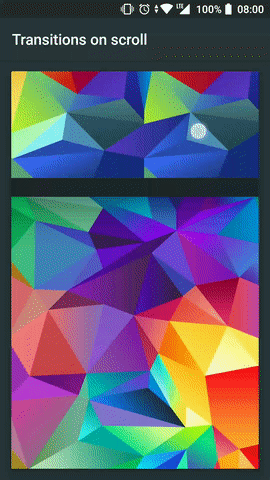

[](https://codebeat.co/projects/github-com-stfalcon-studio-stfalconimageviewer-master)
[](https://www.codacy.com/app/troy.carvill/StfalconImageViewer?utm_source=github.com&amp;utm_medium=referral&amp;utm_content=stfalcon-studio/StfalconImageViewer&amp;utm_campaign=Badge_Grade)
[ ](https://bintray.com/troy379/maven/StfalconImageViewer/_latestVersion)
[](https://opensource.org/licenses/Apache-2.0)

# Stfalcon ImageViewer
A simple and customizable full-screen image viewer with shared image transition support, "pinch to zoom" and "swipe to dismiss" gestures. Compatible with all of the most popular image processing libraries such as `Picasso`, `Glide` etc.
Based on [PhotoView](https://github.com/chrisbanes/PhotoView) by [chrisbanes](https://github.com/chrisbanes).

 

### Who we are
Need iOS and Android apps, MVP development or prototyping? Contact us via info@stfalcon.com. We develop software since 2009, and we're known experts in this field. Check out our [portfolio](https://stfalcon.com/en/portfolio) and see more libraries from [stfalcon-studio](https://stfalcon-studio.github.io/).

### Requirements
* A project configured with the AndroidX
* SDK 19 and and higher

### Demo Application
[](https://play.google.com/store/apps/details?id=com.stfalcon.stfalconimageviewersample)

### Install
Download via **Gradle**:

Add this to the **project `build.gradle`** file:
```gradle
allprojects {
    repositories {
        ...
        maven { url "https://jitpack.io" }
    }
}
```

And then add the dependency to the **module `build.gradle`** file:
```gradle
implementation 'com.github.stfalcon-studio:StfalconImageViewer:v1.0.1'
```

Download via **Maven**:
```
<dependency>
  <groupId>com.github.stfalcon</groupId>
  <artifactId>stfalcon-imageviewer</artifactId>
  <version>latest_version</version>
  <type>pom</type>
</dependency>
```

Where the `latest_version` is the value from `Download` badge.

### Usage
#### Simple usage
All you need to show the viewer is to pass the context, list or array of your image objects and the implementation of the `ImageLoader` and call the `show()` method:
```java
StfalconImageViewer.Builder<Image>(context, images) { view, image ->
    Picasso.get().load(image.url).into(view)
}.show()
```
Piece of cake!

#### Transition animation
To improve the UX of your app you would like to add a transition when a user opens the viewer. And this is simple as never before! Just tell the viewer which image should be used for animation using `withTransitionFrom(myImageView)` method and the library will do it for you!

If you need more advanced behavior like updating transition target while changing images in the viewer please see the sample app for how to do this.

#### Update images list on the fly
There are a lot of common cases (such as pagination, deleting, editing etc.) where you need to update the existing images list while the viewer is running. To do this you can simply update the existing list (or even replace it with a new one) and then call `updateImages(images)`.

#### Change current image
Images are not always leafed through by the user. Maybe you want to implement some kind of preview list at the bottom of the viewer - `setCurrentPosition` is here for help. Change images programmatically wherever you want!

#### Custom overlay view
If you need to show some content over the image (e.g. sharing or download button, description, numeration etc.) you can set your own custom view using the `setOverlayView(customView)` and bind it with the viewer through the `ImageViewer.OnImageChangeListener`.

#### Background
Use the `setBackgroundColorRes(colorRes)` or `setBackgroundColor(colorInt)` to set a color of the fading background.

#### Images margin
Simply add margins between images using the `withImagesMargin(context, dimenRes)` method for dimensions, or use the `withImageMarginPixels(int)` for pixels size.

#### Container padding
Overlay image hides part of the images? Set container padding with dimens using `withContainerPadding(context, start, top, end, bottom)` or `withContainerPadding(context, dimen)` for all of the sides evenly.
For setting a padding in pixels, just use the `withContainerPadding(...)` methods variant.

#### Status bar visibility
Control the status bar visibility of the opened viewer by using the `withHiddenStatusBar(boolean)` method (`true` by default)

#### Gestures
If you need to disable some of the gestures - you can use the `allowSwipeToDismiss(boolean)` and `allowZooming(boolean)` methods accordingly.

#### Options overview
Here is the example with all of the existing options applied:
```java
StfalconImageViewer.Builder<String>(this, images, ::loadImage)
            .withStartPosition(startPosition)
            .withBackgroundColor(color)
            //.withBackgroundColorResource(R.color.color)
            .withOverlayView(view)
            .withImagesMargin(R.dimen.margin)
            //.withImageMarginPixels(margin)
            .withContainerPadding(R.dimen.padding)
            //.withContainerPadding(R.dimen.paddingStart, R.dimen.paddingTop, R.dimen.paddingEnd, R.dimen.paddingBottom)
            //.withContainerPaddingPixels(padding)
            //.withContainerPaddingPixels(paddingStart, paddingTop, paddingEnd, paddingBottom)
            .withHiddenStatusBar(shouldHideStatusBar)
            .allowZooming(isZoomingAllowed)
            .allowSwipeToDismiss(isSwipeToDismissAllowed)
            .withTransitionFrom(targeImageView)
            .withImageChangeListener(::onImageChanged)
            .withDismissListener(::onViewerDismissed)
            .withDismissListener(::onViewerDismissed)
```

Also, you can take a look at the [sample project](https://github.com/stfalcon-studio/StfalconImageViewer/tree/master/sample) for more information.

### Usage with Fresco
If you use the Fresco library - check out the [FrescoImageViewer](https://github.com/stfalcon-studio/FrescoImageViewer) which was also developed by our team.

### License
```
Copyright (C) 2018 stfalcon.com

Licensed under the Apache License, Version 2.0 (the "License");
you may not use this file except in compliance with the License.
You may obtain a copy of the License at

http://www.apache.org/licenses/LICENSE-2.0

Unless required by applicable law or agreed to in writing, software
distributed under the License is distributed on an "AS IS" BASIS,
WITHOUT WARRANTIES OR CONDITIONS OF ANY KIND, either express or implied.
See the License for the specific language governing permissions and
limitations under the License.

```
